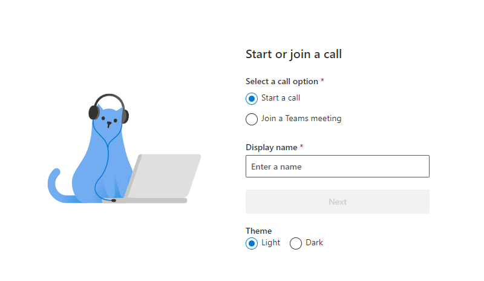

# Azure Communication Services Sample

## Overview

This is a sample application to show how we can use the `@azure/communication-react` package to build a calling experience.
Learn more about the [Azure Communication Services UI Library](https://azure.github.io/communication-ui-library/). 
The client-side application is a React based user interface. Alongside this front-end is a NodeJS web application powered by ExpressJS that performs functionality like minting new user tokens for each call participant.



## Prerequisites

- [Visual Studio Code (Stable Build)](https://code.visualstudio.com/Download)
- [Node.js (12.18.4 and above)](https://nodejs.org/en/download/)
- Create an Azure account with an active subscription. For details, see [Create an account for free](https://azure.microsoft.com/free/?WT.mc_id=A261C142F).
- Create an Azure Communication Services resource. For details, see [Create an Azure Communication Resource](https://docs.microsoft.com/azure/communication-services/quickstarts/create-communication-resource). You'll need to record your resource **connection string** for this quickstart.

## Code structure

- ./client/src/app: Where the client code lives
- ./client/src/app/App.tsx: Entry point into the calling sample
- ./client/src/app/views/HomeScreen.tsx:
- ./client/src/app/views/CallScreen.tsx:
- ./client/src/app/views/EndCall.tsx:
- ./client/src/app/views/UnsupportedBrowserPage.tsx:
- ./Server: server code
- ./Server/appsettings.json: Where to put your azure communication services connection string

## Before running the sample for the first time

1. Open an instance of PowerShell, Windows Terminal, Command Prompt or equivalent and navigate to the directory that you'd like to clone the sample to.

   ```shell
   git clone https://github.com/polatengin/new-mexico.git`
   ```

1. Get the `Connection String` from the Azure portal. For more information on connection strings, see [Create an Azure Communication Resources](https://docs.microsoft.com/azure/communication-services/quickstarts/create-communication-resource)

1. Once you get the `Connection String`, add the connection string to the **samples/Server/appsetting.json** file. Input your connection string in the variable: `ResourceConnectionString`.

> There are two other properties in the appsettings.json file (EndpointUrl, AdminUserId). For the Calling Hero Sample these two properties are unnecessary. We use this file with our chat hero sample and that is where those strings are used.

## Local run

1. Install dependencies

    ```bash
    npm run setup
    ```

1. Start the calling app

    ```bash
    npm run start
    ```

    This will open a client server on port 3000 that serves the website files, and an api server on port 8080 that performs functionality like minting tokens for call participants.

### Troubleshooting

1. The app shows an "Unsupported browser" screen but I am on a [supported browser](https://docs.microsoft.com/en-us/azure/communication-services/concepts/voice-video-calling/calling-sdk-features#calling-client-library-browser-support).

If your app is being served over a hostname other then localhost, you must serve traffic over https and not http.

## Publish to Azure

1. `npm run setup`
2. `npm run build`
3. `npm run package`
4. Use the [Azure extension](https://code.visualstudio.com/docs/azure/extensions) and deploy the `Calling/dist` directory to your app service

## Additional Reading

- [Azure Communication Services - UI Library](https://azure.github.io/communication-ui-library/) - To learn more about what the `@azure/communication-react` package offers.
- [Azure Communication Calling SDK](https://docs.microsoft.com/azure/communication-services/concepts/voice-video-calling/calling-sdk-features) - To learn more about the calling web sdk
- [FluentUI](https://developer.microsoft.com/fluentui#/) - Microsoft powered UI library
- [React](https://reactjs.org/) - Library for building user interfaces
